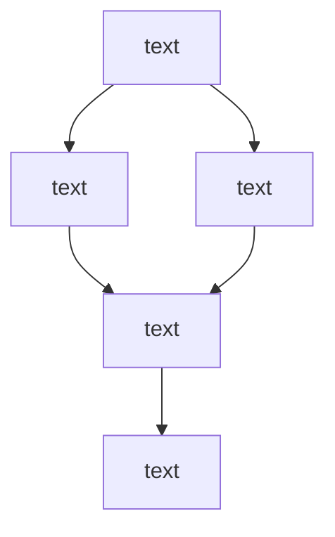

## 📝 Effective Information Security Writing - Chris Sanders

Notes from Chris Sanders Applied Network Defense Course

## Summary
* xx
* xx

### Why writing scares us

* **Fear of not sounding competent** – Overthinking leads to slow, overly complex writing.
* **Worry about missing key points** – Anxiety over leaving something important out.
* **Self-doubt about writing ability** – Feeling like a "bad writer."
* **Fear of being wrong** – Concern about making mistakes or being incorrect.
* **Imposter syndrome** – Feeling unqualified to write or share ideas.
  
### Overcoming a fear of writing
* The Prism Strategy
  - **Your perspective is unique** – Even familiar topics gain new life through your lens.
  - **Personal experience adds value** – How you learned something matters as much as what you learned.
  - **Originality comes from viewpoint** – It’s not about being first, it’s about being *you*.
  - **Your voice can be the one that makes it click** – Even if others have covered the topic before.
  - **Unique framing matters** – Your approach may resonate where others didn’t.
  - **Personal insight creates connection** – Sharing how *you* understand something helps others understand it too.
  - **Impact isn't about being first** – It's about being relatable, clear, and human.
* Set up an Advisory Board
  - find people who can review you writing but also people who you are okay with getting feedback from.
* Keep a journal
  - Capture the crazy thoughts bouncing around.
* Write more publicly

### Why is communication important?
* Wide range of writing we do:
  - status reports
  - case notes
  - meeting notes
  - slack chat
  - email etc
* We spend 20-30% of our day on communication related tasks
* So we need to do it well, e.g. "I get frustrated that the organisations I assess don't ever implement my recommendations, even a year or more after I compromise their network" - this can be remedied by **becoming more convincing** in your writing.

### On writing
* Your writing lasts a long time, e.g your investigation notes may be referred to down the track by others
* Once you write something, the words belong to your reader and their meaning can change
* How you express your findings and your technical work will dictate a portion of your future success
* An analyst needs to be good at reading the things people want to read about.

### Course outline
1. Telling a story - Chris' big secret to writing good content
2. Common writing mistakes - word choice and structure
3. Writing penetration testing reports
4. Forensic writing - compromise reports, malware analysis reports and case notes
5. Tips

### Telling a story
* Technical writing can use some aspects of creative writing
  - Imaginative
  - Entertain
  - Captivate
  - Evocative
* The content can be factual whilst also being **imaginative**. E.g. You can describe the actions malware took and then pivot to a discussion of how you could have caught it sooner if you had better endpoint visibility. Or the destruction that could have been wrought if the malware decided to override the master boot record of the infected server.
* Creative writing makes things much more readable. Add a richer description of what happened.

 

**Your writing has to tell a story**

* People remember things they emotionally connect with
* They emotionally connect with things that they can relate to
* Put the reader in your shoes and make them experience it as you did
* **Build empathy**

 

1. Tell a real story
2. Adapt previous stories
3. Make one up to illustrate your point

* Referred to as a 'what if analysis', where you branch a real story into a series of hypothetical scenarios to plan for potential future scenarios. Combine technical and creative writing to hook your reader.
* Use the stories to persaude your reader into taking an action, e.g. better securing your network or devoting more resources towards security monitoring.

### Elements of a story

__________________
Sources:
1. [Chris Sanders Effective Information Security Writing, Applied Network Defense](https://www.networkdefense.io/p/course-list/)
